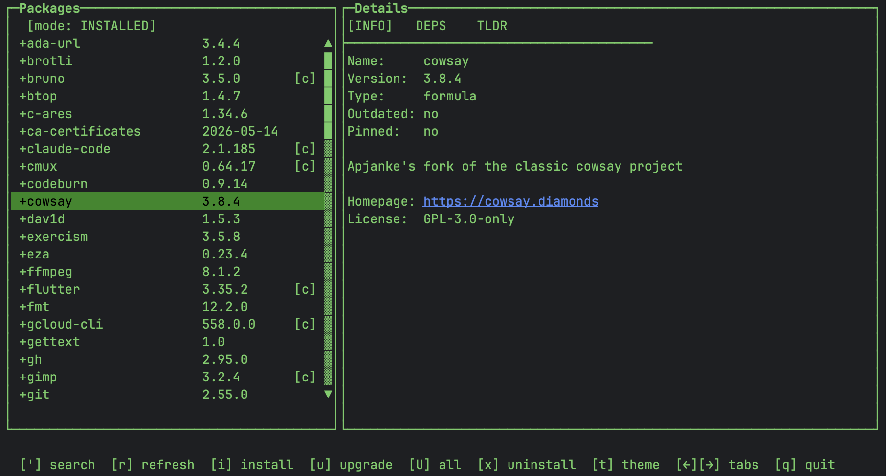

# breui

A terminal UI for managing Homebrew packages on macOS — browse, search, install, upgrade, and uninstall without leaving the terminal.



## Features

- Browse installed formulae and casks
- Search Homebrew and install packages
- Upgrade individual packages or all at once
- Live progress log for install/upgrade operations
- `tldr` integration in the detail panel (falls back to `brew desc`)
- Dependency visualization: see what a package depends on and what depends on it
- Color highlighting: dependencies (cyan), dependents (yellow), selected package (green)
- Multiple Lanterna themes (6 available; switch with `t`)
- Background `brew update` on launch
- Built-in help system (`h`)

## Requirements

- macOS with [Homebrew](https://brew.sh) installed
- Java 25+
- [`tldr`](https://tldr.sh) (optional — for tldr tab content)

## Build & Run

```bash
./gradlew shadowJar
java -jar build/libs/breui.jar
```

## Keyboard Shortcuts

| Key | Action |
|-----|--------|
| `'` | Toggle Installed ↔ Search mode / focus search |
| `↑` / `↓` | Navigate list |
| `←` / `→` | Switch detail tab (Info / Deps / tldr) |
| `i` | Install selected package |
| `u` | Upgrade selected package |
| `U` | Upgrade all outdated packages |
| `x` | Uninstall selected package |
| `t` | Open theme chooser |
| `h` | Show help & shortcuts |
| `r` | Refresh installed list |
| `Esc` | Close overlay |
| `q` | Quit |

## Display

**Package List Colors:**
- 🟢 **Green** — selected package
- 🔵 **Cyan** — dependencies of selected package
- 🟡 **Yellow** — packages that depend on the selected package

**Detail Tabs:**
- **Info** — name, version, description, homepage, license
- **Deps** — dependencies and dependents (formulas only; casks have no dependencies)
- **TLDR** — quick command examples cached from `tldr` or `brew desc`

## License

[MIT](LICENSE)
